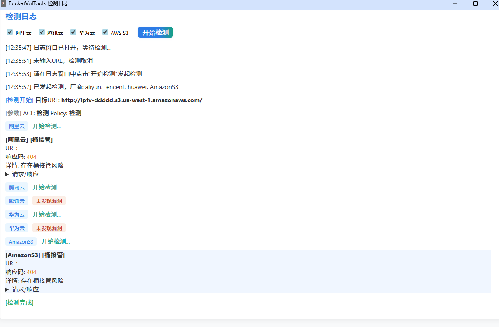
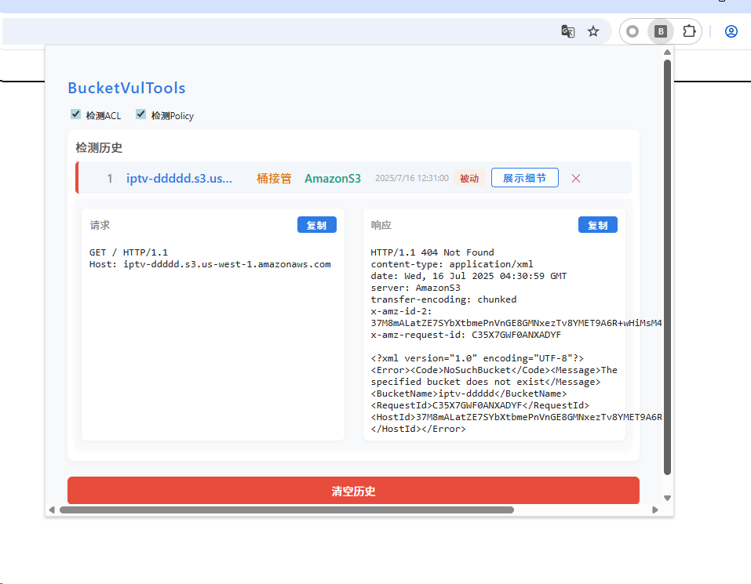

# BucketTool

## 项目简介

BucketTool 是一款浏览器扩展，用于检测主流云存储桶（如阿里云OSS、腾讯云COS、华为云OBS、AWS S3）常见的安全漏洞，包括遍历、未授权上传、ACL/Policy配置、桶接管等，由于之前BurpSuite插件更新需要考虑版本兼容性，因此改造为浏览器插件方便使用。

## 主要功能
- 一键检测存储桶常见漏洞
- 支持阿里云、腾讯云、华为云、AWS S3
- 检测结果实时日志展示，结构化历史记录
- 检测结果红点提醒，点击弹窗可查看历史
- 仅主动检测时输出详细日志，被动检测仅写入历史

## 支持的云厂商
- 阿里云 OSS
- 腾讯云 COS
- 华为云 OBS
- AWS S3（含中国区）

## 使用方法
1. **安装扩展**：
   - 在 Chrome/Edge 浏览器扩展管理页面（chrome://extensions/）开启开发者模式，加载本项目目录。
2. **主动检测**：
   - 点击扩展图标，打开日志窗口，选择厂商，输入存储桶URL，点击“开始检测”。
   - 检测过程和结果会实时显示在日志窗口。
3. **被动检测**：
   - 浏览器访问页面时自动检测 URL 中的云存储桶，发现漏洞会在历史中记录并红点提醒。

## 主要界面说明
- **日志窗口**：显示主动检测的过程和结果。

  

- **历史记录**：记录所有检测到的漏洞。

  

- **红点提醒**：有新漏洞时扩展图标显示红点，查看历史后自动清除。

## 注意事项
- 仅检测公开可访问的存储桶，无法检测需鉴权的私有桶。
- 检测请求为匿名访问，不会携带用户凭证。
- 检测结果仅供安全测试与自查，禁止用于非法用途。

---

如有建议或问题，欢迎反馈！
